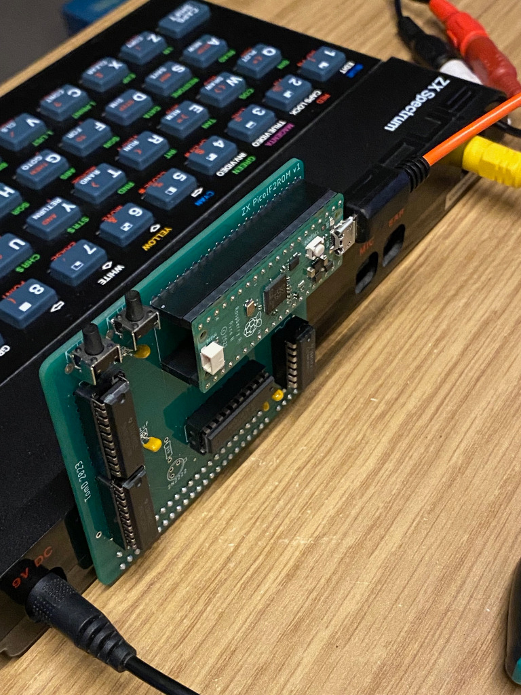
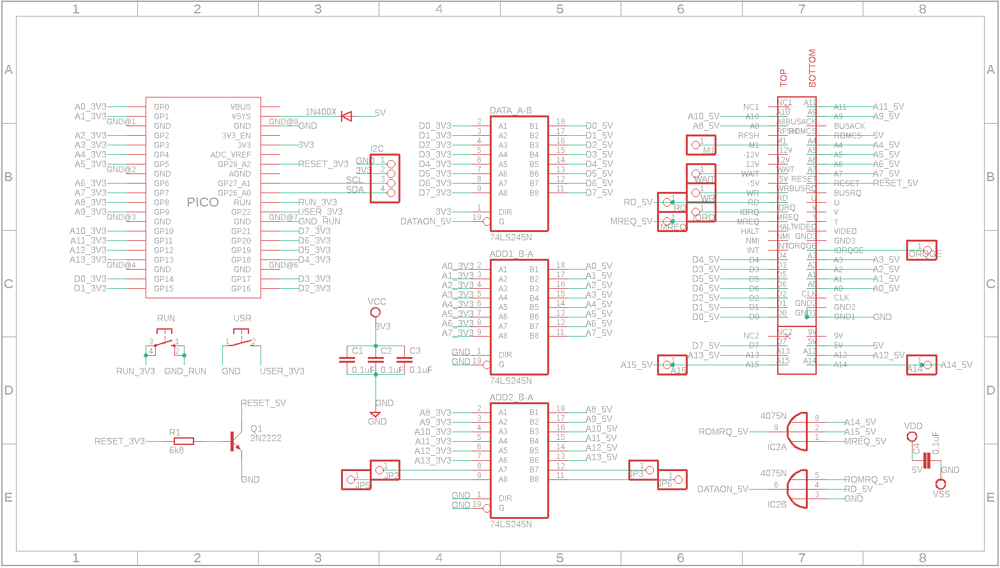
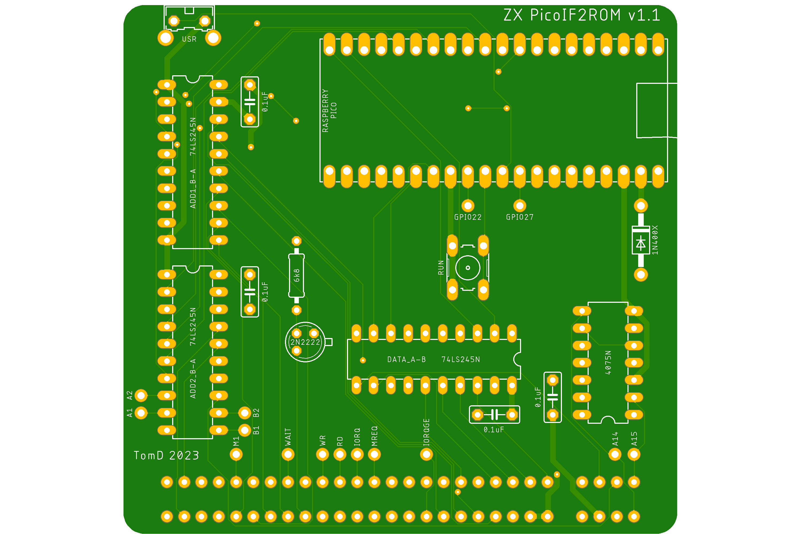

# ZXPicoIF2ROM
IF2 ROM Cartridge Replacement using a Raspberry Pico. Makes use of the PIO state machine of the Raspberry Pico which removes the need to overclock the PICO.

Based on the original design by Derek Fountain https://github.com/derekfountain/zx-spectrum-pico-rom

## PIO & DMA

Derek's original design used one of the processors of the RP2040 to read the ADDRESS pins and write out the DATA lines if required. In order to do this fast enough the RP2040 needed to be overclocked. For my version I decided to use the PIO, mainly as I wanted to learn how to use it. The PIO has many advantages including being fast enough to avoid an overclock but also it works completely independently from the main CPU and is not affected by things like interrupts.

In order for the PIO to work it needs to be coupled with the PICOs DMA which will feed the PIO with the correct data to write to the DATA lines. I first saw how this could work from the 6502 example on Rumbledethumps YouTube channel (https://www.youtube.com/watch?v=GOEI2OpMncY&t=374s) and adapted this to work on the ZX Spectrum. The idea is to set-up two DMA channels, one will get the memory address required from the PIO FIFO and use that to tell the second DMA channel what data to send back the PIO FIFO. The code included on this GitHub details how this works but to summarise:
1. PIO reads the 14 address pins (A0-A13) to the ISR
2. The ISR is auto pushed into the PIO FIFO RX
3. DMA channel 1 reads the PIO FIFO RX and puts this into the DMA channel 2 read address
4. DMA channel 2 pushes the data at the new read address to the PIO FIFO TX
5. PIO ouputs the PIO FIFO TX to the data pins (D0-D7)
6. Loop to 1

There are also a couple of additional set-up steps such as enabling the PIO to convert the 14bit address read to a 32bit address in PICO memory but it is all detailed in the code.

My initial design has the PIO wait for the correct signal before sending the data (WAIT statement till A14, RD, A15 & MREQ are all zero) but I determined that this was not need as this can be accomplished just using the output enable (OE) pin on the 74LS245 chip. This pin controls whether data is actually sent to the Spectrum or not so simply connecting this to the OR of MREQ, A14, A15 & RD means only when all 4 are 0 is any data sent. This is basically a ROM (0-16383bytes) Read (RD) Memory Request (MREQ). This allowed me to simplfy the PIO code to just loop constantly reading the address and writing the data.

## Schematic

The main changes from Derek's original circuit was to put the Address & Data GPIOs in order which is required for the PIO code. I also removed the ouput from the OR chip to the PICO as I shifted to just controlling the data output using the OE pin as described above. This freed up a couple of GPIOs which I decided to allocate to a I2C connector just in case I wanted to attach a screen or something else.

## PCB

For the PCB design I moved the components to the reverse of the PCB meaning I could mount some components lower down, knowing they wouldn't clash with the case, thus giving more room. I also shifted to using through hole components instead of surface mount due to my soldering skills.

