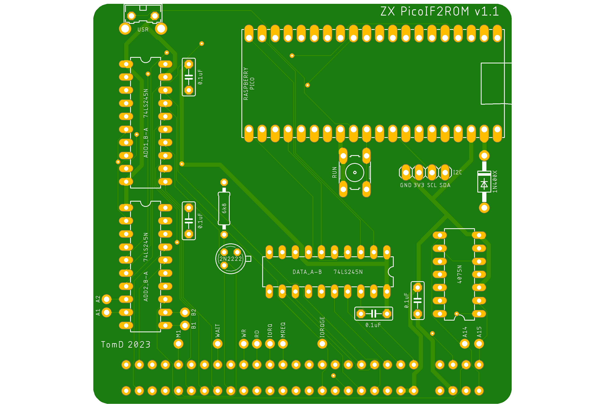

***I've discontinued this project replacing it with [ZX PicoZXCx](https://github.com/TomDDG/ZXPicoZXCx)***

# ZXPicoIF2ROM
IF2 ROM Cartridge Replacement using a Raspberry Pico. Makes use of the PIO state machine of the Raspberry Pico which removes the need to overclock the PICO.

Based on the original design by Derek Fountain https://github.com/derekfountain/zx-spectrum-pico-rom. This GitHub has a lot of great detail on how this all works so recommend a read.

## Usage

Usage is very simple. On every cold boot the Spectrum will default to the first ROM in the `roms[]` array which is basically the ROMs in the `roms.h` header file. To change the ROM you simply press and hold (firmware v0.3+) the user button for >1second. Upon release the new ROM will boot. If you want to simply reset the Spectrum just press the user button and do not hold down. As of v0.4 there is also now a display which tells you which ROM is being loaded. Also if you hold down the user button it will cycle through the ROMs. I've uploaded a quick video to YouTube of it in action:

To add more ROMs or change the ones provided here simply add them to the header file. As of v0.4 firmware you need to compress the ROMs first before adding. The `compressrom` utility will do this for you, creating a header file which can simply be copied into the main `roms.h` file, make sure you keep `switchrom` in this header file which is needed for the main code. After adding to the `roms.h` file you need to update the `roms[]` arrray with the corect header name, add the display name you want to the `romname[]` array (max 32chars) and make sure the `MAXROMS` define is set to the correct number of ROMs available.

If you would like to try out different ROMs there are a lot on Paul Farrow's website http://www.fruitcake.plus.com/Sinclair/Interface2/Cartridges/Interface2_RC_Cartridges.htm

For demonstration purposes I have included the following ROMs:
- Original ZX Spectrum ROM (copyright Amstrad)
- Retroleum DiagROM v1.59 by Retroleum (http://blog.retroleum.co.uk/electronics-articles/a-diagnostic-rom-image-for-the-zx-spectrum/)
- ZX Spectrum Diagnostics v0.37 by Brendan Alford (https://github.com/brendanalford/zx-diagnostics/releases/tag/v0.37)
- ZX Spectrum Test Cartridge (copyright Amstrad)
- 128k RAM Tester by Paul Farrow (http://www.fruitcake.plus.com/Sinclair/Interface2/Cartridges/Interface2_RC_New_RAM_Tester.htm)
- Looking Glass ROM by Geoff Wearmouth as used on the Spectrum Next (https://gitlab.com/thesmog358/tbblue/-/tree/master/machines/next)

## Compressed ROMs

From firmware v0.4 I shifted to use compressed ROMs just to save a little space if you want to add a lot of ROMs. PICO flash is 2MB so space for ~100 ROMs, so not a massive issue but no need to waste space. I added a little utility `compressrom` which compresses a ROM binary file and creates the approprite header file to use with the main code. The utility will also pad 8kB ROMs to 16kB saving the need to do this manually.

## PIO & DMA

Derek's original design used one of the processors of the RP2040 to read the ADDRESS pins and write out the DATA lines if required. In order to do this fast enough the RP2040 needed to be overclocked. For my version I decided to use the PIO (https://www.raspberrypi.com/news/what-is-pio/) mainly as I wanted to learn how to use it. The PIO has many advantages including being fast enough to avoid an overclock but also it works completely independently from the main CPU and is not affected by things like interrupts.

In order for the PIO to work it needs to be coupled with the PICOs DMA which will feed the PIO with the correct data to write to the DATA lines. I first saw how this could work from the 6502 example on Rumbledethumps YouTube channel (https://www.youtube.com/watch?v=GOEI2OpMncY&t=374s) and adapted this to work on the ZX Spectrum. The idea is to set-up two DMA channels, one will get the memory address required from the PIO FIFO and use that to tell the second DMA channel what data to send back the PIO FIFO. The code included on this GitHub details how this works but to summarise:
1. PIO reads (IN) the 14 address pins (A0-A13) to the ISR
2. The ISR is auto pushed into the PIO FIFO
3. DMA channel 1 reads the PIO FIFO and puts this into the DMA channel 2 read address
4. DMA channel 2 sends the single byte of data (8bits) at the new read address to the PIO FIFO
5. PIO auto pushes the PIO FIFO to the OSR which is then outputted (OUT) to the data pins (D0-D7)
6. Wrap back to 1

The PIO allows for the set-up of independent input and output pins which fits perfectly for this use case. There are also a couple of additional set-up steps such as enabling auto-push on the PIO and converting the 14bit address read in to a 32bit address in PICO memory. This is all detailed in the code.

My initial design had the PIO wait for the correct signal before sending the data (WAIT statement on A14, RD, A15 & MREQ all being zero) but I determined that this was not need as it can be accomplished just using the output enable (OE) pin on the 74LS245 chip. This pin controls whether data is actually sent to the Spectrum or not so simply connecting this to the OR of MREQ, A14, A15 & RD means only when all 4 are 0 is any data sent. This is basically a ROM (0-16383bytes) Read (RD) Memory Request (MREQ). This allowed me to simplify the PIO code to just loop constantly reading the address and writing the data.

## Schematic

The main changes from Derek's original circuit was to put the Address & Data GPIOs in order which is required for the PIO code. I also removed the output from the OR chip to the PICO as I shifted to just controlling the data output using the OE pin as described above. This freed up a couple of GPIOs which I decided to allocate to an I2C connector just in case I wanted to attach a screen or something else.

## PCB

For the PCB design I moved the components to the reverse of the PCB meaning I could mount some components lower down, knowing they wouldn't clash with the case, thus giving more room. I also shifted to using through hole components instead of surface mount due to my soldering skills. I also added a RUN button which basically resets the PICO, useful for flashing new firmware or recovering the PICO if it crashes (which is never does).

v1.1 Gerbers are available in the file https://github.com/TomDDG/ZXPicoIF2ROM/blob/main/picoif2_2023-05-04.zip

I've also created a simple 3D Printed case for the PCB which you can find on Printables https://www.printables.com/model/479276-zxpicoif2rom-v11pcb-case

